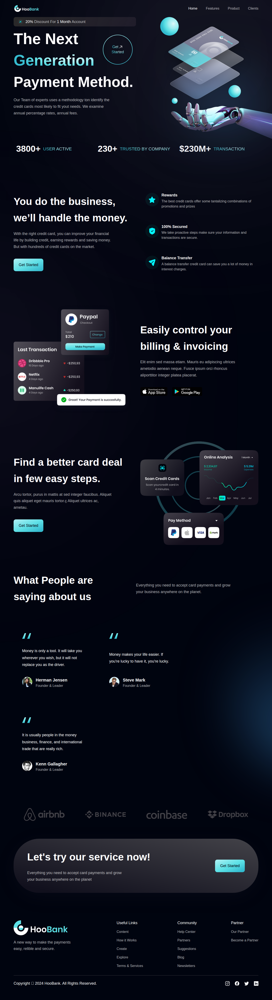

# HooBank - Modern Banking Landing Page

A modern, responsive fintech landing page built with React, Vite, and TailwindCSS. HooBank showcases a sleek design for a next-generation payment platform with stunning gradients, smooth animations, and a professional UI.



## ✨ Features

- **Modern Design**: Sleek, professional fintech UI with custom gradients and animations
- **Fully Responsive**: Optimized for all devices from mobile to desktop
- **Lightning Fast**: Built with Vite for optimal performance and hot module replacement
- **Component-Based**: Modular React components for easy maintenance and scalability
- **TailwindCSS**: Utility-first CSS framework for rapid UI development
- **Interactive Elements**: Smooth hover effects and engaging user interactions
- **Professional Sections**:
  - Hero section with compelling call-to-action
  - Statistics showcase
  - Business features highlight
  - Billing and payment solutions
  - Customer testimonials
  - Company partnerships
  - Contact and footer information

## 🚀 Tech Stack

- **Frontend Framework**: React 18.3.1
- **Build Tool**: Vite 5.4.0
- **Styling**: TailwindCSS 3.4.9
- **Language**: JavaScript (ES6+)
- **Development Tools**: ESLint, PostCSS, Autoprefixer

## 📦 Installation

1. **Clone the repository**
   ```bash
   git clone https://github.com/kyASse/modern-app.git
   cd modern-app
   ```

2. **Navigate to the project directory**
   ```bash
   cd vite-project
   ```

3. **Install dependencies**
   ```bash
   npm install
   ```

4. **Start the development server**
   ```bash
   npm run dev
   ```

5. **Open your browser** and visit `http://localhost:5173`

## 🛠️ Available Scripts

In the `vite-project` directory, you can run:

- **`npm run dev`** - Starts the development server with hot reload
- **`npm run build`** - Builds the app for production to the `dist` folder
- **`npm run preview`** - Serves the production build locally for testing
- **`npm run lint`** - Runs ESLint to check for code quality issues

## 📁 Project Structure

```
modern-app/
├── vite-project/
│   ├── public/                 # Static assets
│   ├── src/
│   │   ├── assets/            # Images, icons, and media files
│   │   ├── components/        # Reusable React components
│   │   │   ├── Navbar.jsx     # Navigation component
│   │   │   ├── Hero.jsx       # Hero section
│   │   │   ├── Stats.jsx      # Statistics section
│   │   │   ├── Business.jsx   # Business features
│   │   │   ├── Billing.jsx    # Billing section
│   │   │   ├── CardDeal.jsx   # Card deals section
│   │   │   ├── Testimonials.jsx # Customer testimonials
│   │   │   ├── Clients.jsx    # Client partnerships
│   │   │   ├── CTA.jsx        # Call-to-action section
│   │   │   ├── Footer.jsx     # Footer component
│   │   │   └── index.js       # Component exports
│   │   ├── constants/         # Application constants and data
│   │   ├── App.jsx           # Main application component
│   │   ├── main.jsx          # Application entry point
│   │   ├── index.css         # Global styles
│   │   └── style.js          # Style utilities
│   ├── index.html            # HTML template
│   ├── package.json          # Dependencies and scripts
│   ├── tailwind.config.js    # TailwindCSS configuration
│   ├── vite.config.js        # Vite configuration
│   └── eslint.config.js      # ESLint configuration
├── LICENSE                   # MIT License
└── README.md                 # This file
```

## 🎨 Key Components

### Navigation
- Responsive navigation bar with smooth scrolling
- Mobile-friendly hamburger menu
- Brand logo and navigation links

### Hero Section
- Eye-catching gradient backgrounds
- Compelling headline and call-to-action
- Interactive "Get Started" button
- Responsive design with mobile optimization

### Features Showcase
- Statistics display with impressive numbers
- Business feature highlights with icons
- Security and rewards information
- Balance transfer benefits

### Customer Social Proof
- Customer testimonials with photos
- Company partnership logos
- Trust indicators and credibility markers

## 🌟 Design Highlights

- **Color Scheme**: Professional dark theme with cyan accents
- **Typography**: Poppins font family for modern readability
- **Gradients**: Custom CSS gradients for visual appeal
- **Responsive Breakpoints**: Optimized for xs, sm, md, lg, and xl screens
- **Interactive Elements**: Hover effects and smooth transitions

## 🚀 Deployment

### Build for Production
```bash
npm run build
```

The build artifacts will be stored in the `dist/` directory, ready for deployment to any static hosting service like:
- Netlify
- Vercel
- GitHub Pages
- AWS S3
- Firebase Hosting

### Preview Production Build
```bash
npm run preview
```

## 🤝 Contributing

Contributions are welcome! Please feel free to submit a Pull Request. For major changes, please open an issue first to discuss what you would like to change.

1. Fork the project
2. Create your feature branch (`git checkout -b feature/AmazingFeature`)
3. Commit your changes (`git commit -m 'Add some AmazingFeature'`)
4. Push to the branch (`git push origin feature/AmazingFeature`)
5. Open a Pull Request

## 📄 License

This project is licensed under the MIT License - see the [LICENSE](LICENSE) file for details.

## 👤 Author

**kyASse** - [GitHub Profile](https://github.com/kyASse)

## ⭐ Show Your Support

Give a ⭐️ if this project helped you!

---

*Built with ❤️ using React, Vite, and TailwindCSS*
